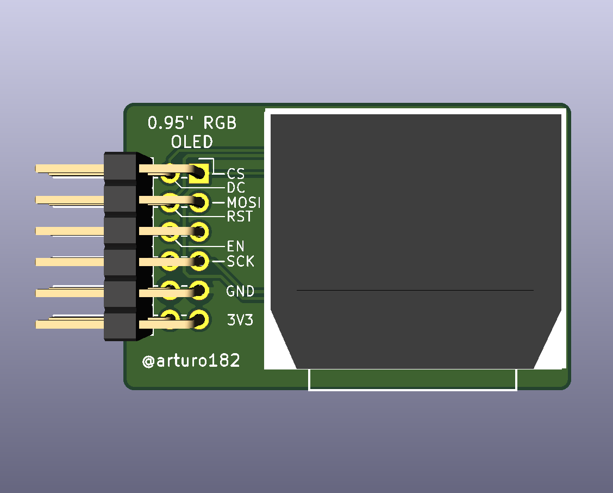
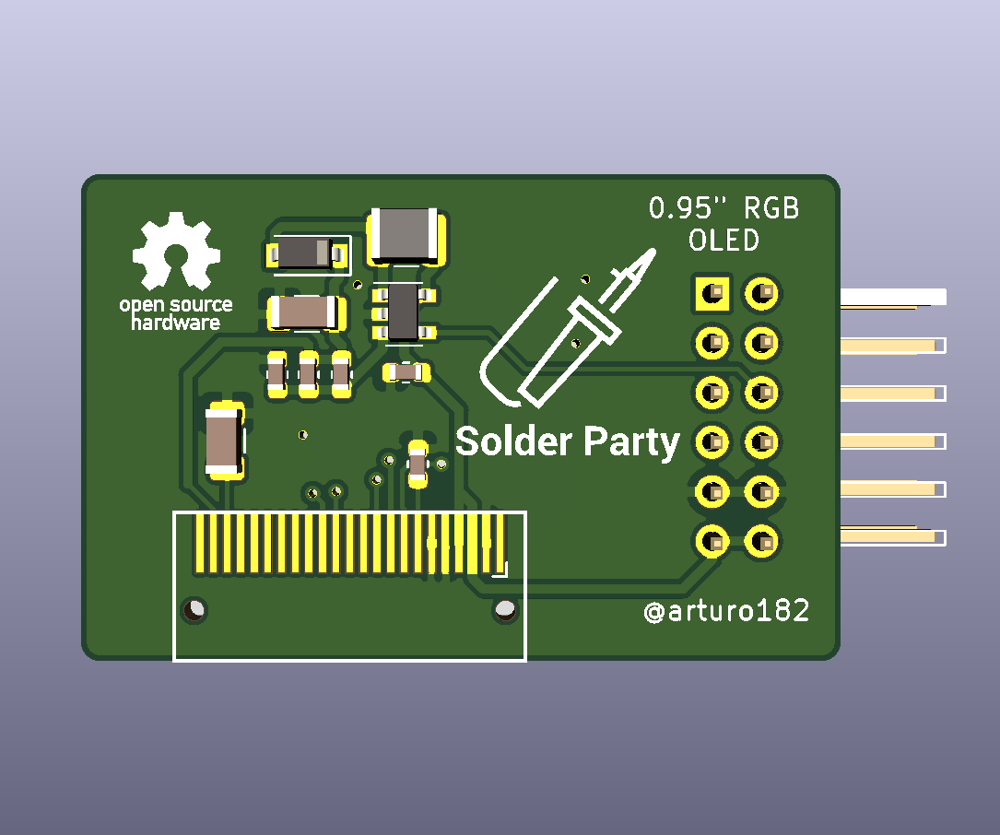
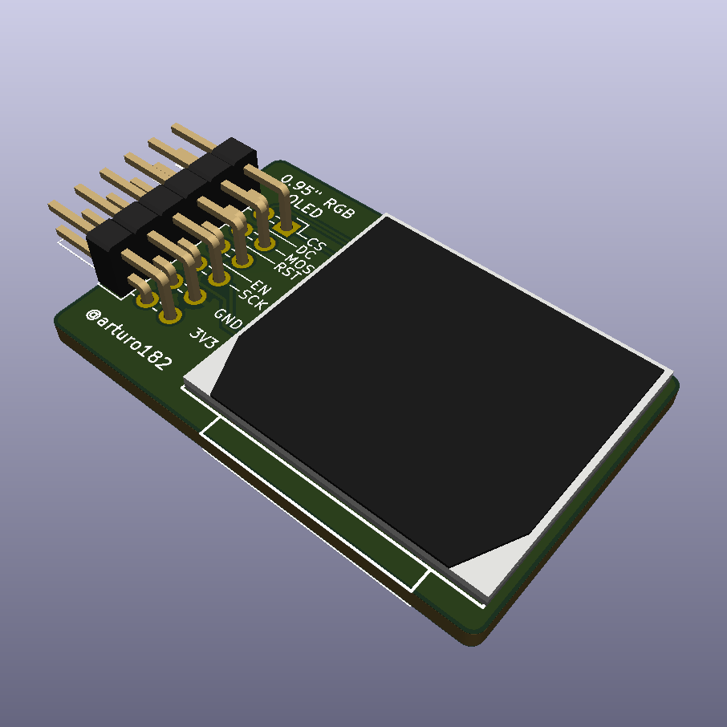

# 0.95" OLED PMOD

A tiny color OLED!

Perfect solution if you need a small display with vivid, high-contrast 16-bit color. PMOD connector can be used with FPGA and MCU dev boards

The display itself is a 0.95" color OLED, the resolution is 96x64 RGB pixels.

The display is driven by the SSD1331 IC, you can control it with a 4-wire write-only SPI. The board only supports 3.3V logic.

Libraries exist to interface the PMOD:
- [Arduino library](https://github.com/adafruit/Adafruit-SSD1331-OLED-Driver-Library-for-Arduino)
- [CircuitPython library](https://github.com/adafruit/Adafruit_CircuitPython_SSD1331)

**Note: This module is not 5V-tolerant!**

Documentation licensed under the Creative Commons Attribution Share Alike 4.0 International License
